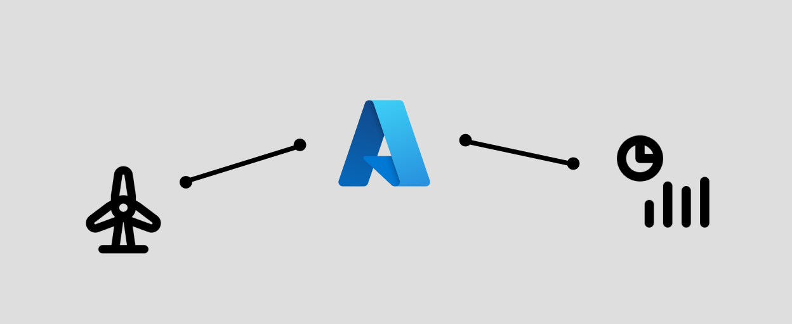

This repository contains the data and code to train a machine learning model on data from a wind turbine to predict energy production. The directory `serverless-function` contains everything needed to deploy the machine learning model on Azures Function App service as a serverless function, including the already trained model. 

Please note that the machine learning model is not perfect and only used for demonstration purposes. If you would like to point out any improvements, feel free to open an issue or contact me directly. 

To deploy serverless function apps for Python on Azure, you'll need:
* An actvive subscription in Azure
* VS Code as well as some Azure Extentions
* Python 3.8 or higher
* Optional: [Azure function core tools](https://learn.microsoft.com/en-us/azure/azure-functions/functions-run-local?tabs=v4%2Cwindows%2Ccsharp%2Cportal%2Cbash)

The data used for this project was taken from [here](https://www.kaggle.com/datasets/theforcecoder/wind-power-forecasting).